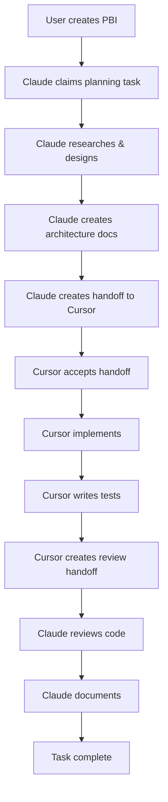

# Implementation Guide

**Template Version**: 1.0.0  
**Last Updated**: [AUTO_GENERATED]

This guide explains how to use this multi-agent project template.

---

## Quick Start (5 Minutes)

### Option 1: New Project from Template

```bash
# Clone template repository
git clone [TEMPLATE_REPO_URL] my-new-project
cd my-new-project

# Run setup script
./scripts/setup-project.sh "My Project Name"

# Start working!
source scripts/agent-helpers.sh
agent_help
```

### Option 2: Apply to Existing Project

```bash
# Copy template files to existing project
cp -r [TEMPLATE_PATH]/{AGENTS.md,docs,scripts,.github} .

# Update project name
./scripts/setup-project.sh "Existing Project Name"

# Merge with existing PROJECT_POLICY.md if you have one
```

---

## For AI Agents

### First Time in Project

1. **Read the foundation**:
   ```
   Read: AGENTS.md (5 minutes)
   ```

2. **Read project specifics**:
   ```
   Read: docs/PROJECT_POLICY.md (3 minutes)
   ```

3. **Read your config**:
   ```
   Read: docs/agents/config/[your-type].md (3 minutes)
   ```

4. **Register yourself**:
   ```bash
   source scripts/agent-helpers.sh
   agent_register [type] "[capabilities]"
   ```

5. **Check for handoffs**:
   ```bash
   ls docs/agents/handoffs/*-to-[your-type].md
   ```

6. **Start working**:
   - Check `docs/delivery/backlog.md` for PBIs
   - Claim a task aligned with your capabilities
   - Follow AGENTS.md protocols

### Every Session

```bash
# Load helpers
source scripts/agent-helpers.sh

# Register (if new session)
agent_register [type] "[capabilities]"

# Log session start
log_activity [agent-id] session-start N/A "Starting session for [purpose]"

# Check for handoffs
ls docs/agents/handoffs/*-to-[type].md

# Do work (following AGENTS.md)
# ...

# Before ending
# 1. Complete any handoffs
# 2. Release all locks
# 3. Update manifest to offline
# 4. Log session end
```

---

## For Humans

### Project Setup

1. **Customize PROJECT_POLICY.md**:
   - Add project-specific coding standards
   - Define team workflows
   - Set testing requirements
   - Add quality gates

2. **Create first PBI**:
   ```bash
   # Edit backlog
   vim docs/delivery/backlog.md
   
   # Add PBI row with ID, user story, CoS
   
   # Create PBI directory
   mkdir -p docs/delivery/1
   
   # Create PRD
   cp docs/templates/prd-template.md docs/delivery/1/prd.md
   
   # Create tasks list
   cp docs/templates/tasks-template.md docs/delivery/1/tasks.md
   ```

3. **Configure CI/CD**:
   - Review `.github/workflows/agent-checks.yml`
   - Add project-specific checks
   - Configure deployment pipelines

### Managing AI Work

**Daily**:
- Check `docs/agents/manifest.md` for active agents
- Review `docs/agents/activity.md` for progress
- Look for stale locks: `source scripts/agent-helpers.sh && check_stale_locks`

**Weekly**:
- Review completed handoffs
- Archive old handoffs
- Check for pending handoffs: `check_pending_handoffs`
- Update agent routing rules if needed

**Monthly**:
- Archive activity logs >90 days
- Review agent performance
- Update templates based on lessons learned

### Assigning Work

**Let agents self-assign based on capabilities**:
1. Create PBI with clear user story
2. Break into tasks in PBI's `tasks.md`
3. Set task status to "Agreed"
4. Agent claims based on type and capability

**Manual assignment**:
1. Create handoff document in `docs/agents/handoffs/`
2. Set task status to "ReadyForHandoff"
3. Notify agent via comment or discussion

---

## Directory Structure

```
project-root/
├── AGENTS.md                           # Universal Agent Standard
├── README.md                           # Project overview
├── .gitignore                          # Git ignore rules
│
├── docs/
│   ├── PROJECT_POLICY.md              # Project-specific rules
│   ├── IMPLEMENTATION_GUIDE.md        # This file
│   │
│   ├── agents/                        # Agent coordination
│   │   ├── manifest.md               # Agent registry
│   │   ├── activity.md               # Activity log
│   │   ├── locks.md                  # File locks
│   │   │
│   │   ├── config/                   # Agent configurations
│   │   │   ├── claude.md
│   │   │   └── cursor.md
│   │   │
│   │   ├── handoffs/                 # Work transfers
│   │   │   └── _TEMPLATE.md
│   │   │
│   │   └── archive/                  # Old logs
│   │       └── activity-YYYY-MM.md
│   │
│   └── delivery/                      # Work tracking
│       ├── backlog.md                # Product backlog
│       └── [PBI-ID]/                 # Per-PBI directories
│           ├── prd.md                # Detailed requirements
│           ├── tasks.md              # Task list
│           └── [PBI-ID]-[N].md       # Individual tasks
│
├── scripts/
│   ├── setup-project.sh              # Project initialization
│   └── agent-helpers.sh              # Agent utilities
│
└── .github/
    └── workflows/
        └── agent-checks.yml          # Automated compliance
```

---

## Common Workflows

### Workflow 1: Claude Plans, Cursor Implements



**Steps**:

1. **User**: Create PBI in backlog
2. **Claude**: 
   - Register session
   - Claim planning task (PBI-X-1)
   - Research best practices (web search)
   - Create architecture document
   - Create handoff to Cursor
   - Update task status: ReadyForHandoff
   
3. **Cursor**:
   - Register session
   - Accept handoff from Claude
   - Claim implementation task (PBI-X-2)
   - Implement per architecture
   - Write and run tests
   - Create review handoff to Claude
   
4. **Claude**:
   - Accept review handoff
   - Review code vs architecture
   - Create/update documentation
   - Approve task completion

### Workflow 2: Parallel Work on Different PBIs

```
Claude working on PBI-5 (new feature planning)
  ├─ Task: PBI-5-1 (architecture)
  ├─ Status: InProgress
  └─ Files: Creating docs/delivery/5/architecture.md

Cursor working on PBI-6 (bug fix)
  ├─ Task: PBI-6-1 (implement fix)
  ├─ Status: InProgress
  └─ Files: Modifying src/api/users.ts

No conflicts:
  ✓ Different PBIs
  ✓ Different files
  ✓ Both registered in manifest
  ✓ Both logging in activity
```

### Workflow 3: Handling Lock Conflicts

```
Cursor (10:00):
  → Needs src/api/users.ts
  → Checks locks.md: unlocked
  → Acquires lock
  → Begins implementation

Claude (10:15):
  → Needs to review src/api/users.ts
  → Checks locks.md: locked by Cursor
  → Options:
     1. Wait for Cursor (typical: 30 min)
     2. Review latest committed version
     3. Choose different task
  → Claude chooses option 2
  → Reviews last commit
  → Notes will re-review after Cursor unlocks
```

---

## Helper Scripts Usage

### agent-helpers.sh

```bash
# Load helpers (at start of session)
source scripts/agent-helpers.sh

# See all available commands
agent_help

# Register session
agent_register claude "planning,research,docs,web-search"
# Output: ✓ Agent registered: claude-20250111-1430

# Log activity
log_activity claude-20250111-1430 task-claimed PBI-5-1 "Starting architecture design"
# Output: ✓ Activity logged

# Lock file
lock_file src/api/users.ts cursor-20250111-0900 PBI-6-1 "Implementing user endpoints"
# Output: ✓ File locked: src/api/users.ts

# Show active locks
show_locks
# Output: Active file locks:
#         | src/api/users.ts | cursor-20250111-0900 | ... |

# Unlock file
unlock_file src/api/users.ts
# Output: ✓ File unlocked: src/api/users.ts

# Create handoff
create_handoff PBI-5-1 claude cursor
# Output: ✓ Handoff document created: docs/agents/handoffs/PBI-5-1-claude-to-cursor.md

# Check for stale locks
check_stale_locks
# Output: Checking for stale locks (>1 hour)...
#         ✓ No stale locks found

# Check for pending handoffs
check_pending_handoffs
# Output: Checking for pending handoffs (>24 hours)...
#         ✓ No stale handoffs found
```

---

## Maintenance

### Daily Tasks

```bash
# Check agent health
source scripts/agent-helpers.sh
check_stale_locks
check_pending_handoffs
show_locks
```

### Weekly Tasks

```bash
# Archive completed handoffs
mv docs/agents/handoffs/*-acknowledged-*.md docs/agents/archive/handoffs/

# Review activity log for patterns
tail -n 100 docs/agents/activity.md

# Update agent routing if needed
vim docs/PROJECT_POLICY.md  # Section 6: Agent Routing
```

### Monthly Tasks

```bash
# Archive old activity logs
DATE_3_MONTHS_AGO=$(date -d '3 months ago' +%Y-%m)
mv docs/agents/activity.md docs/agents/archive/activity-${DATE_3_MONTHS_AGO}.md
cp docs/agents/activity.md.template docs/agents/activity.md

# Review template improvements
# Update based on lessons learned
```

---

## Troubleshooting

### Issue: Agent not following AGENTS.md

**Symptoms**: Missing logs, skipped handoffs, no file locks

**Solution**:
1. Add reminder to README.md
2. Create pre-commit hook to verify agent registration
3. User should explicitly reference AGENTS.md when assigning work

### Issue: Too many lock conflicts

**Symptoms**: Agents frequently waiting for file locks

**Solution**:
1. Review task breakdown - make tasks more independent
2. Improve task sequencing in PBI
3. Reduce parallel work on same PBI
4. Consider file/module reorganization

### Issue: Handoffs incomplete

**Symptoms**: Receiving agent asking many questions, work blocked

**Solution**:
1. Review and improve handoff template
2. Add handoff checklist to PROJECT_POLICY.md
3. Require peer review of handoffs
4. Create handoff quality rubric

### Issue: Activity log too large

**Symptoms**: activity.md >10MB, slow to load

**Solution**:
```bash
# Archive more frequently
source scripts/agent-helpers.sh
# TODO: Add archive function to helpers

# Or split by month
mv docs/agents/activity.md docs/agents/archive/activity-$(date +%Y-%m).md
# Create new activity log from template
```

---

## Customization

### Add New Agent Type (e.g., GitHub Copilot)

1. **Create config**:
   ```bash
   vim docs/agents/config/copilot.md
   ```

2. **Define capabilities**:
   ```markdown
   # Copilot Agent Configuration
   
   **Capabilities**: code-completion, inline-suggestions
   
   **Best For**: Inline code completion, boilerplate
   
   **Integration**: Works via IDE alongside Cursor
   ```

3. **Update routing**:
   ```bash
   vim docs/PROJECT_POLICY.md
   # Add Copilot to Section 6: Agent Routing
   ```

4. **Update AGENTS.md**:
   ```bash
   vim AGENTS.md
   # Add to agent type reference section
   ```

### Add Project-Specific Quality Gates

```bash
# Edit PROJECT_POLICY.md
vim docs/PROJECT_POLICY.md

# Add section:
## 11. Quality Gates

### Before Handoff to Review
- [ ] All tests passing
- [ ] Code coverage >80%
- [ ] No linting errors
- [ ] Security scan clean
- [ ] Performance benchmarks met
```

### Create Custom Handoff Templates

```bash
# Create specialized template
vim docs/agents/handoffs/_SECURITY_HANDOFF_TEMPLATE.md

# Content:
# Handoff: Security Review - [Task-ID]
#
# Additional Requirements:
# - [ ] Threat model created
# - [ ] Security scan results
# - [ ] Penetration test completed
# - [ ] Compliance checklist filled
```

---

## Advanced Topics

### Integrating with CI/CD

The included `.github/workflows/agent-checks.yml` provides basic checks.

**Extend with**:
- Automated handoff validation
- Lock timeout enforcement
- Status consistency verification
- Activity log format validation

### Metrics and Analytics

**Track**:
- Average time per task (by agent type)
- Handoff success rate
- Lock conflict frequency
- Test pass rate on first submission

**Visualize**:
```bash
# Create simple report
cat docs/agents/activity.md | \
  grep "task-completed" | \
  wc -l
# = Number of completed tasks

# More sophisticated: parse activity log with script
```

### Multi-Repository Projects

For projects spanning multiple repos:

1. **Shared manifest**: Central manifest tracking all agents
2. **Cross-repo handoffs**: Include repo name in handoff ID
3. **Unified activity log**: Aggregate logs from all repos

---

## Getting Help

**For setup issues**: Review this guide, check troubleshooting section

**For workflow questions**: See agent configs in `docs/agents/config/`

**For protocol clarification**: Read AGENTS.md sections

**For improvements**: Document in activity log, propose changes

---

## Next Steps

1. ✅ Project set up from template
2. → Customize PROJECT_POLICY.md for your needs
3. → Create first PBI in docs/delivery/backlog.md
4. → Have AI agent register and start work
5. → Monitor and adjust based on experience

---

**Template maintained at**: [TEMPLATE_REPO_URL]  
**Version**: 1.0.0  
**Last updated**: [AUTO_GENERATED]
